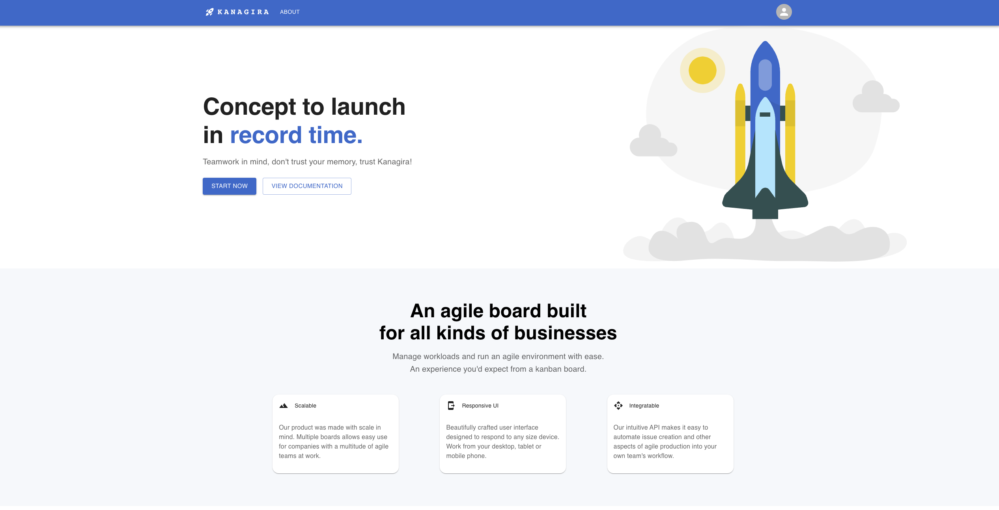
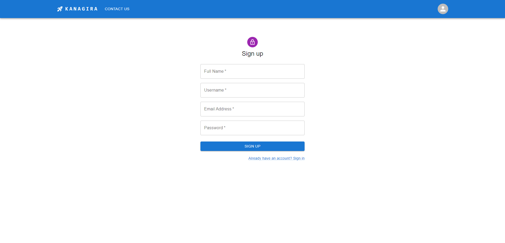
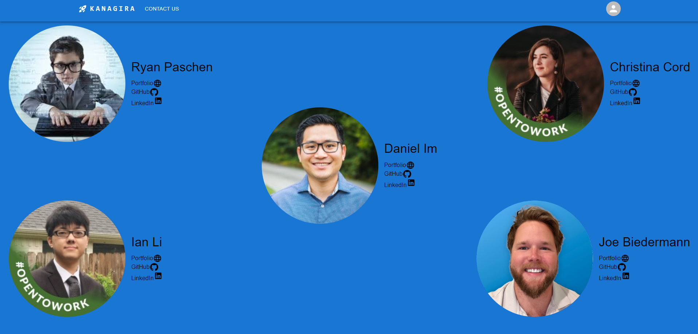

## GHI

## Homepage

-Homepage is the initial landing for users. We immediately present them with our mission statement and what benefits our application can provide them with.

## Sign up Page

-This is where users will create their secured and protected accounts with us. Upon completion, they will automatically be signed in and re-routed to the dashboard.

## Login

-Here is where users with accounts can log in.

## Boards Page

-This page is where logged in users can see all of the boards.

## Board View

-Here users can view all the details of their selected boards. That includes swim lanes and issues within those swim lanes.

## Create Board Form

-This is our form users will use to create a new board.

## Issue Detail View

- This is where you can see the details of a specific issue within your board/swimlane

## Issues View

-Issues View is where users will see all of the issues that they are assigned to.

## Create Issue Form

-With this form, users can create new issues for specific boards they are viewing.

## Contact Page

-Here users can see all of the developers for the application, as well as link to our portfolios, LinkedIns, and GitHubs.

